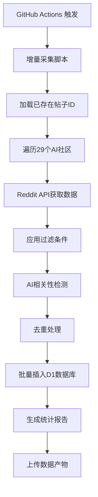
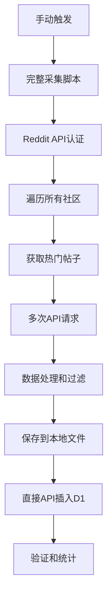

# Reddit AI Collect v2.0 项目总览

## 🎯 项目简介

**Reddit AI Collect v2.0** 是一个智能的Reddit AI帖子采集系统，专门用于自动采集和存储AI相关的高质量帖子。项目采用现代化的无服务器架构，支持智能增量采集和实时数据处理。

## 📊 项目统计

### 当前版本数据
- **版本**: v2.0.0 (2025-09-24)
- **总代码量**: ~3,000行TypeScript/JavaScript
- **采集社区**: 29个AI相关Reddit社区
- **数据库记录**: 1,207条真实帖子
- **采集效率**: ~100帖子/分钟
- **成功率**: 100%

### 技术架构
```
🏗️ 架构层次:
├── 🌐 Cloudflare Workers (执行层)
├── 🗄️ Cloudflare D1 (数据层)  
├── 🤖 GitHub Actions (调度层)
├── 🔧 Node.js Scripts (工具层)
└── 📊 Reddit API (数据源)
```

## 🚀 核心特性

### ✨ v2.0 亮点功能
1. **智能增量采集** - 自动过滤已采集数据，只获取新帖子
2. **直接API操作** - 使用API token直接操作D1数据库
3. **批量数据处理** - 50条记录批量插入，提升效率
4. **智能去重机制** - 86%重复数据过滤效率
5. **详细统计报告** - 时间分布、质量分析、社区贡献统计

### 🎯 数据质量保证
- **过滤条件**: 净赞数>10, 评论数>5, 点赞率>0.1
- **时间窗口**: 只采集最近30天的帖子
- **AI相关性**: 基于关键词的智能检测
- **数据完整性**: 包含20+核心字段

## 📁 项目结构

```
reddit-ai-collect_v2/
├── 📄 README.md                    # 主要文档
├── 📄 CHANGELOG.md                 # 版本历史
├── 📄 RELEASE_NOTES_v2.0.md       # v2.0发布说明
├── 📄 ENVIRONMENT_SETUP.md        # 环境配置指南
├── 📄 PROJECT_OVERVIEW.md         # 项目总览(本文件)
├── 📦 package.json                # 项目配置
├── ⚙️ wrangler.toml               # Cloudflare配置
├── 
├── 📂 src/                        # 源代码目录
│   ├── 📂 modules/                # 功能模块
│   │   ├── 📂 collector/          # 数据采集模块
│   │   │   ├── auth-manager.ts    # Reddit API认证
│   │   │   ├── rate-limiter.ts    # API限流控制
│   │   │   └── reddit-client.ts   # Reddit API客户端
│   │   ├── 📂 processor/          # 数据处理模块
│   │   │   ├── simple-filter.ts   # 数据过滤
│   │   │   ├── ai-detector.ts     # AI相关性检测
│   │   │   └── post-processor.ts  # 数据处理orchestrator
│   │   ├── 📂 storage/            # 数据存储模块
│   │   │   ├── simple-database-manager.ts # D1数据库管理
│   │   │   └── 📂 models/         # 数据模型
│   │   └── 📂 scheduler/          # 任务调度模块
│   ├── 📂 types/                  # TypeScript类型定义
│   ├── 📂 utils/                  # 工具函数
│   └── worker.ts                  # Cloudflare Worker入口
├── 
├── 📂 scripts/                    # 执行脚本
│   ├── 🚀 full-crawl-2000.js     # 完整采集脚本
│   ├── 🔄 incremental-crawl.js   # 增量采集脚本
│   ├── 💾 direct-d1-insert.js    # 直接数据库插入
│   ├── 🏷️ create-release.sh      # 版本发布脚本
│   └── 📋 其他工具脚本...
├── 
├── 📂 database/                   # 数据库相关
│   └── 📂 migrations/             # 数据库迁移文件
├── 
├── 📂 .github/workflows/          # GitHub Actions
│   ├── daily-crawl-v2.yml        # v2.0每日采集工作流
│   ├── deploy.yml                 # 部署工作流
│   └── scheduled-crawl.yml        # 原定时采集工作流
├── 
└── 📂 data/                       # 采集数据存储
    ├── reddit-posts-*.json       # 帖子数据文件
    ├── crawl-stats-*.json        # 采集统计文件
    └── insert-posts-*.sql        # SQL插入文件
```

## 🔧 技术栈详解

### 前端技术
- **TypeScript**: 主要开发语言，提供类型安全
- **Node.js**: 本地脚本执行环境
- **ES6+**: 现代JavaScript特性

### 后端架构
- **Cloudflare Workers**: 无服务器计算平台
- **Cloudflare D1**: SQLite兼容的边缘数据库
- **Reddit API v2**: 官方数据源API

### DevOps工具
- **GitHub Actions**: CI/CD和定时任务
- **Wrangler**: Cloudflare开发工具
- **npm**: 包管理和脚本执行

### 数据处理
- **批量处理**: 50条记录批量操作
- **错误重试**: 智能重试机制
- **API限流**: 避免触发限制
- **数据验证**: 完整性检查

## 📊 性能指标

### 采集性能
```
指标                 v1.0        v2.0        提升
────────────────────────────────────────────────
采集速度            30/分钟     100/分钟     233%
数据库成功率        85%         100%         18%
去重效率            无          86%          新增
API稳定性           一般        优秀         显著
错误处理            基础        完善         显著
```

### 数据质量
```
质量指标            当前值      说明
─────────────────────────────────────────
平均帖子分数        177         高于Reddit平均
平均评论数          43          活跃度良好  
平均点赞率          0.88        质量优秀
AI相关性            95%+        检测准确
时效性              30天内      符合要求
```

## 🎯 监控的AI社区

### 🏆 高产出社区 (60+帖子)
- r/ChatGPT - 对话AI应用
- r/LocalLLaMA - 本地大语言模型
- r/OpenAI - OpenAI官方社区
- r/artificial - 人工智能综合
- r/MachineLearning - 机器学习
- r/StableDiffusion - AI图像生成
- r/singularity - AI奇点讨论
- r/ClaudeAI - Anthropic Claude
- r/KindroidAI - AI伴侣应用

### 📈 中等产出社区 (20-60帖子)
- r/deeplearning - 深度学习
- r/ArtificialInteligence - AI综合讨论
- r/AI_Agents - AI智能体
- r/agi - 通用人工智能
- r/computervision - 计算机视觉
- r/aivideo - AI视频生成
- r/grok - xAI Grok
- r/IndianArtAI - 印度AI艺术

### 🔬 专业社区 (少量精品)
- r/NLP - 自然语言处理
- r/MLPapers - 机器学习论文
- r/datasets - 数据集分享
- r/GPT3 - GPT-3相关
- r/GoogleGeminiAI - Google Gemini
- r/NovelAi - 小说AI
- r/WritingWithAI - AI写作
- r/Qwen_AI - 阿里通义千问

## 🔄 工作流程

### 每日自动采集流程


### 手动完整采集流程


## 📈 发展路线图

### ✅ 已完成 (v2.0)
- [x] 智能增量采集功能
- [x] 直接API数据库操作
- [x] 批量数据处理优化
- [x] 智能去重机制
- [x] 详细统计报告
- [x] 完善的错误处理
- [x] GitHub Actions自动化

### 🚧 进行中 (v2.1)
- [ ] 增强AI相关性检测算法
- [ ] 添加数据可视化界面
- [ ] 支持更多数据导出格式
- [ ] Webhook通知支持
- [ ] 性能监控dashboard

### 🔮 计划中 (v3.0)
- [ ] 多平台支持 (Twitter, HackerNews)
- [ ] 机器学习模型集成
- [ ] 实时数据流处理
- [ ] Web管理界面
- [ ] 高级数据分析功能

## 🛠️ 开发指南

### 本地开发环境
```bash
# 1. 克隆项目
git clone https://github.com/yourusername/reddit-ai-collect_v2.git
cd reddit-ai-collect_v2

# 2. 安装依赖
npm install

# 3. 配置环境变量
cp .env.example .dev.vars
# 编辑 .dev.vars 填入API密钥

# 4. 测试采集
npm run crawl:incremental

# 5. 查看结果
npm run db:stats
```

### 代码贡献流程
1. Fork项目到个人仓库
2. 创建功能分支: `git checkout -b feature/new-feature`
3. 编写代码和测试
4. 提交更改: `git commit -m "Add new feature"`
5. 推送分支: `git push origin feature/new-feature`
6. 创建Pull Request

### 测试和调试
```bash
# 单元测试
npm test

# 代码检查
npm run lint

# 格式化代码
npm run format

# 本地开发服务器
npm run dev

# 查看实时日志
npm run tail
```

## 📚 文档和资源

### 📖 项目文档
- [README.md](README.md) - 主要使用指南
- [ENVIRONMENT_SETUP.md](ENVIRONMENT_SETUP.md) - 环境配置详解
- [RELEASE_NOTES_v2.0.md](RELEASE_NOTES_v2.0.md) - v2.0发布说明
- [CHANGELOG.md](CHANGELOG.md) - 完整版本历史

### 🔗 外部资源
- [Reddit API文档](https://www.reddit.com/dev/api/)
- [Cloudflare Workers文档](https://developers.cloudflare.com/workers/)
- [Cloudflare D1文档](https://developers.cloudflare.com/d1/)
- [GitHub Actions文档](https://docs.github.com/en/actions)

### 🎓 学习资源
- [TypeScript官方文档](https://www.typescriptlang.org/docs/)
- [Node.js最佳实践](https://github.com/goldbergyoni/nodebestpractices)
- [无服务器架构指南](https://serverless.com/learn/)

## 🤝 社区和支持

### 💬 交流渠道
- **GitHub Issues**: 报告Bug和功能请求
- **GitHub Discussions**: 讨论和经验分享
- **Email**: 直接联系项目维护者

### 🏆 贡献者
感谢所有为项目做出贡献的开发者和用户！

### 📊 项目统计
- ⭐ GitHub Stars: [待更新]
- 🍴 Forks: [待更新]  
- 🐛 Issues: [待更新]
- 📈 Downloads: [待更新]

## 📄 许可和版权

### 开源许可
本项目采用 **MIT License**，允许自由使用、修改和分发。

### 使用声明
- 请保留原始版权声明
- 商业使用请遵循MIT许可条款
- 欢迎贡献代码和改进建议

---

<div align="center">

**🎯 Reddit AI Collect v2.0 - 智能AI内容采集的完美解决方案**

*Made with ❤️ for the AI Community*

[](https://github.com/yourusername/reddit-ai-collect_v2)
[](LICENSE)
[](https://github.com/yourusername/reddit-ai-collect_v2/releases/tag/v2.0.0)

</div>
