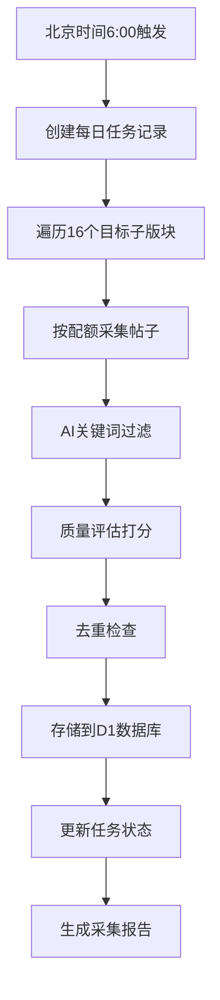

# Reddit AI 内容每日采集系统

## 📋 项目概述

这是一个专门用于从 Reddit 自动获取 AI 相关高质量内容的每日采集系统。**每日北京时间早上6点执行一次**，从16个指定AI子版块全局检索获取200条不重复的优质帖子。

### 🎯 核心特性
- **⏰ 定时采集**: 每日北京时间早上6点自动执行
- **🎲 全局检索**: 覆盖16个核心AI子版块
- **📊 智能分配**: 按社区权重分配200个帖子配额  
- **🔄 自动去重**: 确保每日内容不重复
- **💾 云端存储**: 使用 Cloudflare D1 数据库

## 📁 项目文件结构

```
reddit 爬虫/
├── README_Updated.md                    # 更新的项目说明
├── Reddit_AI_Content_Rules_Manual_v2.0.md  # 完整规则手册
├── database_schema.sql                  # 完整数据库架构
├── cloudflare_d1_setup.sql             # D1数据库初始化脚本 ⭐
├── daily_collection_config.py          # 每日采集配置文件 ⭐
└── requirements.txt                     # Python依赖包
```

## 🏗️ 数据库设计

### 核心表结构 (所有表都加了reddit_前缀)

1. **reddit_ai_posts** - 主帖子表
   - 包含 `crawl_date` 自动生成字段
   - 唯一约束: `UNIQUE(id, crawl_date)` 确保每日去重

2. **reddit_post_keywords** - 关键词提取表
3. **reddit_post_tech_categories** - 技术分类表  
4. **reddit_daily_tasks** - 每日采集任务表 ⭐
5. **reddit_crawl_logs** - 采集日志表
6. **reddit_system_config** - 系统配置表

### 每日去重机制

```sql
-- 主表自动生成采集日期并确保唯一性
crawl_date TEXT GENERATED ALWAYS AS (date(crawl_timestamp, 'unixepoch')) STORED,
UNIQUE(id, crawl_date)  -- 同一帖子每天只能记录一次
```

## 🎯 采集策略配置

### 每日目标分配 (总计200个帖子)

| 社区级别 | 子版块 | 目标帖子数 | 最小分数 | 最小评论数 |
|---------|-------|-----------|---------|-----------|
| **一级核心** | r/MachineLearning | 40 | 100 | 20 |
| | r/artificial | 35 | 80 | 15 |
| | r/deeplearning | 25 | 60 | 10 |
| | r/LocalLLaMA | 20 | 50 | 8 |
| | r/ChatGPT | 15 | 40 | 8 |
| **二级专业** | r/computervision | 12 | 30 | 5 |
| | r/NLP | 10 | 25 | 5 |
| | r/MLPapers | 8 | 20 | 3 |
| | r/StableDiffusion | 8 | 30 | 5 |
| | r/singularity | 7 | 25 | 5 |
| **三级前沿** | r/agi | 5 | 20 | 3 |
| | r/neuralnetworks | 4 | 15 | 3 |
| | r/datasets | 3 | 10 | 2 |
| | r/voiceai | 3 | 10 | 2 |
| | r/MediaSynthesis | 3 | 8 | 2 |
| | r/GPT3 | 4 | 15 | 3 |

### 采集时间安排

```python
# 北京时间每日早上6点执行
DAILY_COLLECTION_TIME = time(6, 0, 0)  # 06:00:00
TIMEZONE = "Asia/Shanghai"
```

## 🚀 快速部署

### 1. 数据库初始化

1. 登录 [Cloudflare Dashboard](https://dash.cloudflare.com/)
2. 创建或选择 D1 数据库
3. 在 D1 控制台执行 `cloudflare_d1_setup.sql`

```sql
-- 验证表创建成功
SELECT name FROM sqlite_master WHERE type='table' ORDER BY name;

-- 检查配置
SELECT config_key, config_value FROM reddit_system_config ORDER BY config_key;
```

### 2. 环境配置

```bash
# 安装依赖
pip install -r requirements.txt

# 配置环境变量
REDDIT_CLIENT_ID=your_client_id
REDDIT_CLIENT_SECRET=your_client_secret
REDDIT_USER_AGENT=AI_Daily_Collector_v1.0

CLOUDFLARE_API_TOKEN=your_api_token
CLOUDFLARE_ACCOUNT_ID=your_account_id
D1_DATABASE_ID=your_database_id

# 采集配置
DAILY_TARGET_POSTS=200
COLLECTION_HOUR=6  # 北京时间
ENABLE_DAILY_DEDUP=true
```

### 3. 采集配置验证

```bash
# 运行配置检查
python daily_collection_config.py
```

输出示例：
```
Reddit AI 内容每日采集配置
==================================================
每日目标帖子数: 200
采集时间: 北京时间每日 06:00:00
目标子版块数量: 16
总目标帖子数验证: 200

下一次采集时间: 2025-01-02 06:00:00+08:00
今日采集日期: 2025-01-01
```

## 📊 采集效果监控

### 每日采集统计查询

```sql
-- 检查每日采集情况
SELECT crawl_date, COUNT(*) as post_count 
FROM reddit_ai_posts 
GROUP BY crawl_date 
ORDER BY crawl_date DESC;

-- 检查每日任务执行情况  
SELECT task_date, target_count, actual_count, task_status, beijing_time
FROM reddit_daily_tasks 
ORDER BY task_date DESC;

-- 验证去重效果 (应该没有重复记录)
SELECT id, COUNT(*) as duplicate_count, GROUP_CONCAT(crawl_date) as dates
FROM reddit_ai_posts 
GROUP BY id 
HAVING COUNT(*) > 1;
```

### 社区采集分布分析

```sql
-- 各子版块每日采集统计
SELECT 
    crawl_date,
    subreddit,
    COUNT(*) as post_count,
    AVG(score) as avg_score,
    AVG(quality_score) as avg_quality
FROM reddit_ai_posts 
WHERE crawl_date >= date('now', '-7 days')
GROUP BY crawl_date, subreddit
ORDER BY crawl_date DESC, post_count DESC;
```

## 🔄 工作流程

### 每日采集流程



### 去重逻辑

1. **数据库约束去重**: `UNIQUE(id, crawl_date)`
2. **应用层检查**: 采集前检查该帖子今日是否已存在
3. **任务级别去重**: 单次任务内避免重复处理

## 🛠️ 技术实现要点

### 时区处理

```python
import pytz
from datetime import datetime, time

BEIJING_TZ = pytz.timezone('Asia/Shanghai')

def get_next_collection_time():
    """获取下一次采集时间 (北京时间)"""
    now = datetime.now(BEIJING_TZ)
    next_collection = now.replace(hour=6, minute=0, second=0, microsecond=0)
    
    if next_collection <= now:
        next_collection = next_collection.replace(day=next_collection.day + 1)
    
    return next_collection
```

### 每日任务管理

```python
def create_daily_task(date_str):
    """创建每日采集任务"""
    task = {
        "task_date": date_str,
        "target_count": 200,
        "actual_count": 0,
        "task_status": "pending",
        "beijing_time": "06:00",
        "subreddits_processed": "[]"
    }
    return task
```

### 配额分配算法

```python
def allocate_posts_by_priority():
    """按优先级分配帖子配额"""
    total_allocated = 0
    for subreddit in TARGET_SUBREDDITS:
        allocated = min(
            subreddit["target_posts"],
            200 - total_allocated
        )
        total_allocated += allocated
        yield subreddit["name"], allocated
```

## 📈 预期效果

### 数据质量指标
- **日均获取量**: 精确200个帖子
- **去重率**: 100% (数据库约束保证)
- **AI相关性**: 95%+ (关键词过滤)
- **平均质量分**: 50+ (多维度评估)

### 覆盖度分析
- **核心社区**: 135个帖子 (67.5%)
- **专业社区**: 48个帖子 (24%)  
- **前沿社区**: 17个帖子 (8.5%)

## 💡 使用建议

### 1. 首次运行
- 先执行数据库初始化脚本
- 验证配置文件无误
- 手动运行一次测试

### 2. 监控重点
- 每日任务执行状态
- 帖子数量是否达标
- 去重机制是否正常

### 3. 优化调整
- 根据实际采集效果调整各社区配额
- 根据质量分布调整筛选阈值
- 根据时效性需求调整采集时间

## 📞 技术支持

- 🔧 数据库问题: 检查 D1 控制台执行日志
- 🐛 采集问题: 查看 `reddit_crawl_logs` 表
- 📊 数据问题: 运行验证查询检查

---

**🌟 核心优势**: 每日定时、精准配额、自动去重、云端存储

**📊 项目状态**: 已配置完成，可直接部署使用
