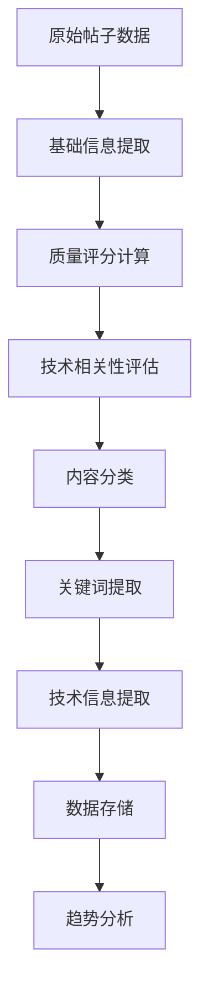
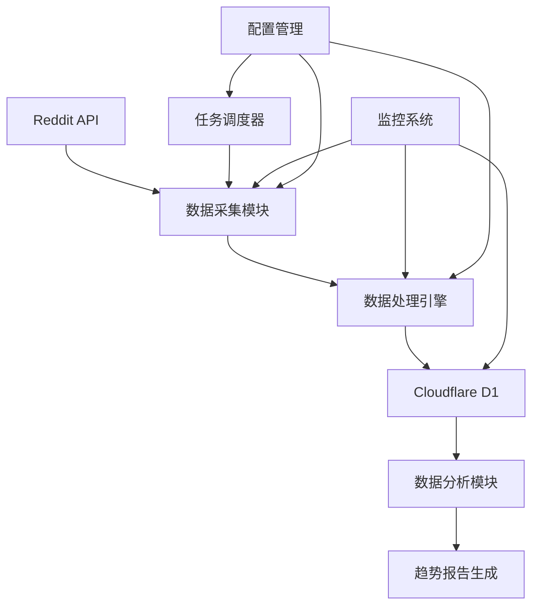

# Reddit AI 内容获取规则手册 v2.0

## 📋 项目概述

本规则手册为 Reddit AI 内容自动获取系统提供完整的操作指南，旨在每日自动化获取 200+ 高质量 AI 相关帖子，并提供深度的关键词提取和技术信息分析。

### 🎯 核心目标
- **数量目标**: 每日获取 200+ 高质量 AI 相关帖子
- **质量保证**: 通过多维度评分确保内容价值
- **技术深度**: 自动提取关键词和技术信息
- **趋势洞察**: 实时监控 AI 技术发展趋势

---

## 1. 项目目标与核心理念

### 1.1 主要目标
- **广度覆盖**: 涵盖 AI 领域各个分支和应用方向
- **深度分析**: 提取核心技术信息和关键概念
- **实时性**: 捕捉最新技术动态和热点讨论
- **可操作性**: 生成可直接用于决策的技术情报

### 1.2 核心理念
- **质量优于数量**: 宁可筛选严格，也要确保内容价值
- **覆盖全维度**: 从基础研究到应用实践全覆盖
- **时效性重要**: 优先获取最新、最热门的讨论
- **智能化处理**: 自动化内容分析和关键词提取

---

## 2. 内容来源规则

### 2.1 一级核心社区（高频监控 - 每日4次）

| 社区名称 | 成员数量 | 专业领域 | 监控重点 |
|---------|---------|---------|----------|
| r/MachineLearning | 3.2M+ | ML核心讨论 | 学术论文、前沿算法 |
| r/artificial | 1.8M+ | 通用AI讨论 | 行业动态、技术趋势 |
| r/deeplearning | 278K+ | 深度学习专业 | 模型架构、训练技巧 |
| r/LocalLLaMA | 180K+ | 本地LLM部署 | 开源模型、部署方案 |
| r/ChatGPT | 800K+ | GPT应用讨论 | 应用案例、提示工程 |

### 2.2 二级专业社区（中频监控 - 每日2次）

| 社区名称 | 成员数量 | 专业领域 | 监控重点 |
|---------|---------|---------|----------|
| r/computervision | 98K+ | 计算机视觉 | 图像处理、目标检测 |
| r/reinforcementlearning | 65K+ | 强化学习 | 算法研究、应用场景 |
| r/NLP | 45K+ | 自然语言处理 | 语言模型、文本分析 |
| r/MLPapers | 35K+ | 学术论文讨论 | 最新论文、研究成果 |
| r/StableDiffusion | 280K+ | 生成式AI | 图像生成、模型优化 |
| r/singularity | 456K+ | AGI与未来AI | 技术奇点、AGI讨论 |

### 2.3 三级前沿社区（低频监控 - 每日1次）

| 社区名称 | 成员数量 | 专业领域 | 监控重点 |
|---------|---------|---------|----------|
| r/agi | 89K+ | 通用人工智能 | AGI研究、理论探讨 |
| r/neuralnetworks | 45K+ | 神经网络研究 | 网络架构、优化算法 |
| r/datasets | 23K+ | 数据集资源 | 开放数据、标注工具 |
| r/voiceai | 15K+ | 语音AI技术 | 语音识别、合成技术 |
| r/MediaSynthesis | 12K+ | 媒体生成技术 | 多模态生成、创意AI |
| r/GPT3 | 89K+ | GPT技术讨论 | GPT系列、大模型应用 |

---

## 3. 排序与筛选规则

### 3.1 多维度筛选策略

#### 一级社区筛选标准
```yaml
hot排序:
  score: ≥ 200
  comments: ≥ 80
  upvote_ratio: ≥ 0.85

rising排序:
  score: ≥ 100
  comments: ≥ 40
  upvote_ratio: ≥ 0.80

new排序:
  score: ≥ 50
  comments: ≥ 20
  age_hours: ≤ 6
```

#### 二级社区筛选标准
```yaml
hot排序:
  score: ≥ 100
  comments: ≥ 40
  upvote_ratio: ≥ 0.80

rising排序:
  score: ≥ 50
  comments: ≥ 20
  upvote_ratio: ≥ 0.75

new排序:
  score: ≥ 25
  comments: ≥ 10
  age_hours: ≤ 8
```

#### 三级社区筛选标准
```yaml
hot排序:
  score: ≥ 50
  comments: ≥ 20
  upvote_ratio: ≥ 0.75

rising排序:
  score: ≥ 25
  comments: ≥ 10
  upvote_ratio: ≥ 0.70

new排序:
  score: ≥ 10
  comments: ≥ 5
  age_hours: ≤ 12
```

### 3.2 内容质量评估算法

```python
def calculate_content_quality_score(post):
    """
    综合质量评分算法 (0-100分)
    """
    engagement_score = min(30, (post.score / 100) * 10 + (post.num_comments / 50) * 20)
    freshness_score = max(0, 20 - (post_age_hours / 24) * 10)
    community_weight = get_community_weight(post.subreddit) * 20
    content_depth = min(20, len(post.selftext) / 100)
    discussion_quality = min(10, post.upvote_ratio * 10)
    
    return engagement_score + freshness_score + community_weight + content_depth + discussion_quality
```

### 3.3 技术相关性过滤

#### AI技术关键词词典
```yaml
核心技术:
  - machine learning, deep learning, neural network
  - transformer, attention mechanism, llm
  - gpt, bert, diffusion model
  - computer vision, nlp, reinforcement learning

应用领域:
  - autonomous driving, robotics, healthcare ai
  - generative ai, multimodal ai, rag
  - chatbot, voice assistant, recommendation

工具框架:
  - pytorch, tensorflow, hugging face
  - openai, anthropic, langchain
  - scikit-learn, keras, jax

前沿概念:
  - agi, artificial general intelligence
  - few-shot learning, zero-shot learning
  - fine-tuning, prompt engineering
  - model compression, quantization
```

---

## 4. 数据字段规则

### 4.1 核心数据表结构

#### 主帖子表 (reddit_ai_posts)
```sql
-- 唯一标识
id TEXT PRIMARY KEY                    -- Reddit帖子ID
permalink TEXT NOT NULL               -- 永久链接
url TEXT                             -- 外部链接

-- 内容主体
title TEXT NOT NULL                  -- 标题
selftext TEXT                        -- 正文
selftext_html TEXT                   -- HTML正文

-- 热度指标
score INTEGER                        -- 得分
upvote_ratio REAL                   -- 点赞比例
num_comments INTEGER                 -- 评论数
total_awards_received INTEGER        -- 奖励数

-- 背景信息
author TEXT                          -- 作者
subreddit TEXT NOT NULL             -- 所属社区
created_utc INTEGER NOT NULL        -- 创建时间

-- 质量评估
quality_score REAL                   -- 质量评分(0-100)
tech_relevance_score REAL           -- 技术相关性(0-10)
ai_category TEXT                     -- AI分类
```

#### 关键词提取表 (post_keywords)
```sql
post_id TEXT                         -- 关联帖子ID
keyword TEXT                         -- 关键词
category TEXT                        -- 分类
confidence_score REAL               -- 置信度
extraction_method TEXT              -- 提取方法
keyword_type TEXT                   -- 关键词类型
```

#### 技术分类表 (post_tech_categories)
```sql
post_id TEXT                         -- 关联帖子ID
primary_category TEXT               -- 主分类
secondary_categories TEXT           -- 次分类(JSON)
confidence_score REAL              -- 分类置信度
tech_stack TEXT                     -- 技术栈(JSON)
application_domain TEXT            -- 应用领域
```

### 4.2 数据处理流程



---

## 5. 内容处理与关键词提取规则

### 5.1 多层次关键词提取策略

#### 第一层：技术栈识别
- **方法**: 基于词典匹配 + 正则表达式
- **目标**: 识别具体技术、框架、模型名称
- **词典覆盖**:
  - LLM模型: GPT-4, Claude, LLaMA, Mistral, Gemini
  - ML框架: PyTorch, TensorFlow, JAX, Scikit-learn
  - AI工具: LangChain, LlamaIndex, AutoGen, CrewAI

#### 第二层：概念抽取
- **方法**: TF-IDF + BERT嵌入
- **目标**: 提取技术概念和方法论
- **处理流程**: 文本预处理 → 特征提取 → 相似度计算

#### 第三层：趋势分析
- **方法**: 时间序列分析 + 频次统计
- **目标**: 识别新兴技术趋势
- **指标**: 关键词出现频率变化率

### 5.2 内容分类规则

#### AI内容分类体系
```yaml
研究论文:
  识别特征: [paper, arxiv, research, study, analysis]
  子分类: [理论研究, 实验结果, 综述文章, 技术报告]

工具资源:
  识别特征: [tool, library, framework, api, model]
  子分类: [开源项目, 商业工具, 数据集, 预训练模型]

应用案例:
  识别特征: [use case, application, demo, project]
  子分类: [商业应用, 个人项目, 教程指南, 最佳实践]

行业动态:
  识别特征: [news, announcement, release, update]
  子分类: [公司动态, 产品发布, 政策法规, 市场分析]
```

### 5.3 技术信息提取规则

#### 模型信息提取
```python
模型识别模式:
  pattern: "(GPT-\d+|Claude-\d+|LLaMA-\d+|Mistral-\d+)"
  context_words: ["model", "architecture", "parameters"]
  
性能指标提取:
  pattern: "(\d+\.?\d*)\s*(BLEU|ROUGE|accuracy|F1|perplexity)"
  context_words: ["performance", "benchmark", "evaluation"]

数据规模提取:
  pattern: "(\d+\.?\d*)\s*(B|M|K|billion|million|thousand)\s*(parameters|tokens)"
  context_words: ["training", "dataset", "corpus"]
```

---

## 6. 自动化与监控策略

### 6.1 采集时间调度

#### 高峰时段策略
- **时间**: 09:00-12:00, 14:00-17:00, 20:00-23:00 (UTC)
- **频率**: 每2小时一次
- **目标**: 捕捉工作时间和晚间活跃讨论

#### 低谷时段策略
- **时间**: 00:00-08:00, 12:00-14:00, 17:00-20:00 (UTC)
- **频率**: 每4小时一次
- **目标**: 维持基础监控，节约API配额

#### 周末策略
- **时间**: 周六日全天
- **频率**: 每3小时一次
- **目标**: 平衡覆盖度和资源消耗

### 6.2 API限制管理

#### Reddit API管理
```yaml
限制: 600次/10分钟
策略: 智能退避 + 请求队列
监控: 实时API余量检查

请求优先级:
  P0: 一级社区 hot/rising 排序
  P1: 二级社区 hot 排序
  P2: 三级社区和其他排序
  P3: 补充数据获取

容错机制:
  重试策略: 指数退避，最多3次重试
  降级方案: API限制时切换到缓存数据
  告警机制: 连续失败5次触发告警
```

### 6.3 数据质量保证

#### 实时验证
- **内容完整性**: 标题、内容、元数据完整性检查
- **重复检测**: 基于ID和内容相似度的去重
- **质量评分**: 实时计算质量分数，过滤低质量内容

#### 批量处理
- **关键词提取**: 每小时批量处理新内容
- **分类标注**: 使用预训练模型自动分类
- **趋势分析**: 每日分析关键词趋势变化

#### 人工审核
- **抽样检查**: 每日随机抽取50条进行人工审核
- **反馈循环**: 基于人工反馈调优筛选规则
- **质量报告**: 生成每周数据质量报告

---

## 7. 目标达成策略

### 7.1 日产出目标分配

```yaml
每日200个帖子分配:
  一级社区: 120个帖子 (60%)
  二级社区: 60个帖子 (30%)
  三级社区: 20个帖子 (10%)

动态调整策略:
  目标不足时: 降低筛选阈值10-20%
  目标超额时: 提高质量要求，保持最优200个
  
质量保证:
  最低质量分: 30分
  平均质量分: 50分以上
  高质量比例: 30%以上(70分+)
```

### 7.2 社区覆盖策略

```yaml
核心社区权重:
  r/MachineLearning: 1.0
  r/artificial: 0.9
  r/deeplearning: 0.8
  r/LocalLLaMA: 0.8
  r/ChatGPT: 0.7

专业社区权重:
  r/computervision: 0.7
  r/NLP: 0.7
  r/MLPapers: 0.8
  r/StableDiffusion: 0.6
  其他: 0.5-0.6
```

---

## 8. 技术架构建议

### 8.1 推荐技术栈

```yaml
数据采集:
  主框架: Python 3.9+ + PRAW 7.7+
  并发处理: asyncio + aiohttp
  任务调度: APScheduler + Celery

数据处理:
  文本处理: NLTK + spaCy + transformers
  关键词提取: scikit-learn + sentence-transformers
  内容分类: 预训练BERT模型微调

数据存储:
  主数据库: Cloudflare D1
  缓存层: Redis (API缓存 + 任务队列)
  文件存储: 本地存储 + 定期备份

监控告警:
  应用监控: 自定义监控脚本
  日志管理: Python logging + 文件轮转
  告警通知: 邮件 + Webhook
```

### 8.2 部署架构



---

## 9. 风险控制与合规

### 9.1 API使用合规
- 严格遵守Reddit API使用条款
- 实现智能限流，避免触发rate limit
- 定期监控API使用情况和成本

### 9.2 数据隐私保护
- 不采集用户个人敏感信息
- 遵循数据最小化原则
- 实施数据生命周期管理

### 9.3 系统稳定性
- 实现多层容错机制
- 定期数据备份和恢复测试
- 建立完善的监控和告警体系

---

## 10. 实施路线图

### Week 1: 基础架构搭建
- [ ] Reddit API接入和认证配置
- [ ] Cloudflare D1数据库初始化
- [ ] 基础爬虫框架开发
- [ ] 简单的筛选规则实现

### Week 2: 核心功能开发
- [ ] 多社区并发采集实现
- [ ] 高级筛选算法开发
- [ ] 关键词提取基础版本
- [ ] 数据存储优化

### Week 3: 智能化提升
- [ ] 内容分类模型训练
- [ ] 质量评分算法优化
- [ ] 自动化调度系统
- [ ] 监控和告警系统

### Week 4: 优化和上线
- [ ] 性能测试和优化
- [ ] 数据质量验证
- [ ] 生产环境部署
- [ ] 监控数据和调优

---

## 11. 附录

### 11.1 常用查询示例

#### 获取高质量帖子
```sql
SELECT title, subreddit, score, quality_score, ai_category
FROM reddit_ai_posts 
WHERE quality_score >= 70 
ORDER BY quality_score DESC, created_utc DESC 
LIMIT 50;
```

#### 分析技术趋势
```sql
SELECT keyword, COUNT(*) as frequency, AVG(quality_score) as avg_quality
FROM post_keywords k
JOIN reddit_ai_posts p ON k.post_id = p.id
WHERE p.created_utc > unixepoch() - 86400
GROUP BY keyword
HAVING frequency >= 5
ORDER BY frequency DESC;
```

#### 社区活跃度统计
```sql
SELECT subreddit, COUNT(*) as post_count, AVG(score) as avg_score
FROM reddit_ai_posts
WHERE created_utc > unixepoch() - 604800
GROUP BY subreddit
ORDER BY post_count DESC;
```

### 11.2 配置文件示例

#### 环境变量配置
```bash
# Reddit API
REDDIT_CLIENT_ID=your_client_id
REDDIT_CLIENT_SECRET=your_client_secret
REDDIT_USER_AGENT=AI_Content_Crawler_v2.0

# Cloudflare D1
CLOUDFLARE_API_TOKEN=your_api_token
CLOUDFLARE_ACCOUNT_ID=your_account_id
D1_DATABASE_ID=your_database_id

# 爬虫配置
DAILY_TARGET_POSTS=200
MIN_QUALITY_SCORE=30
CRAWL_INTERVAL_HOURS=2
```

---

**文档版本**: v2.0  
**最后更新**: 2025-01-01  
**维护者**: AI爬虫团队

> 本规则手册将根据实际运行情况持续优化更新。如有问题或建议，请及时反馈。
